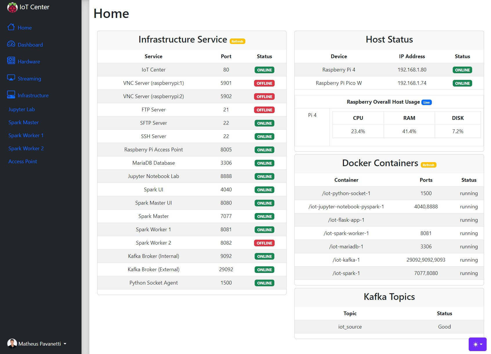
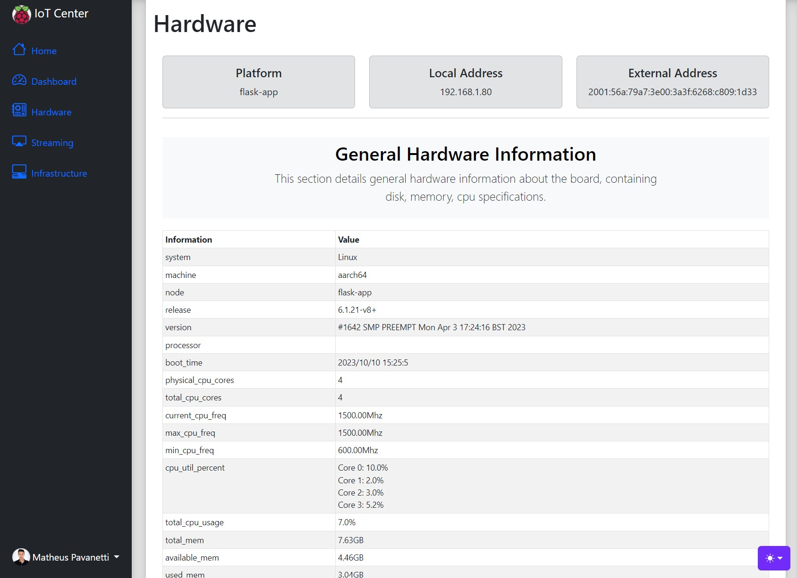
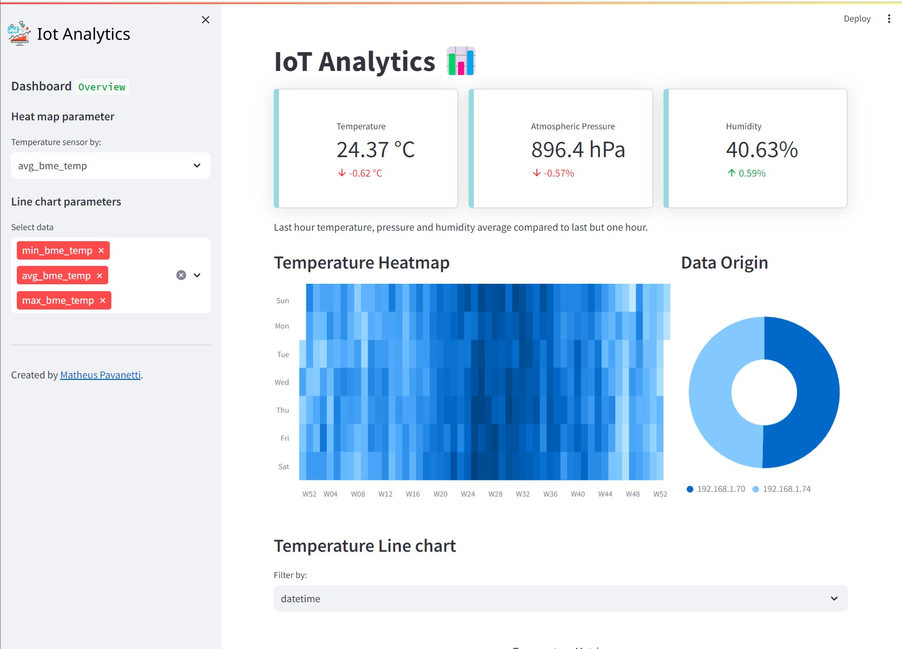
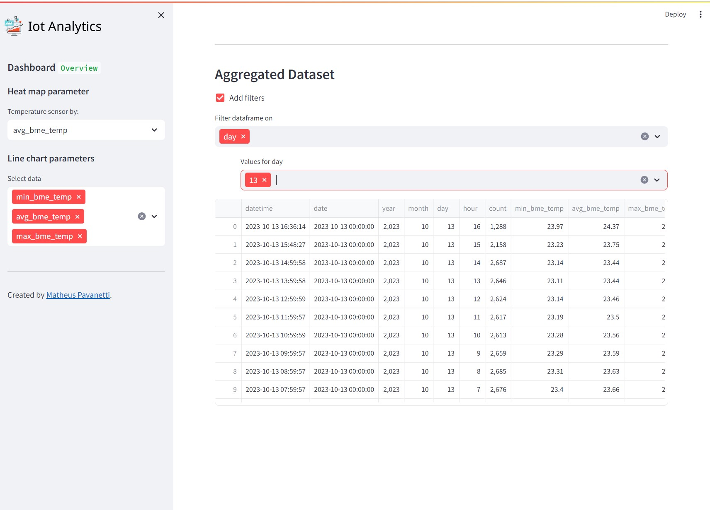
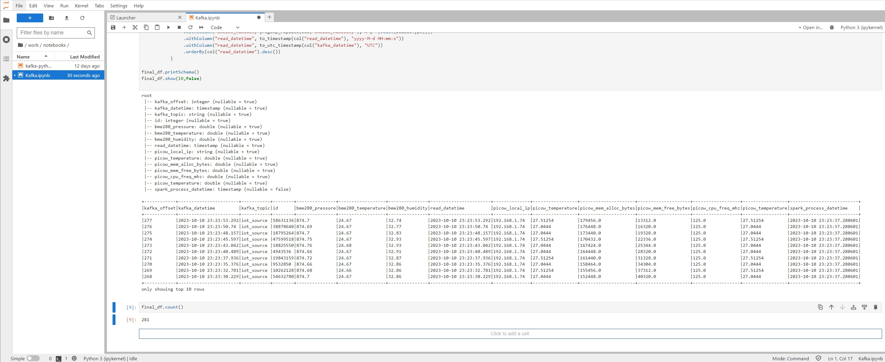
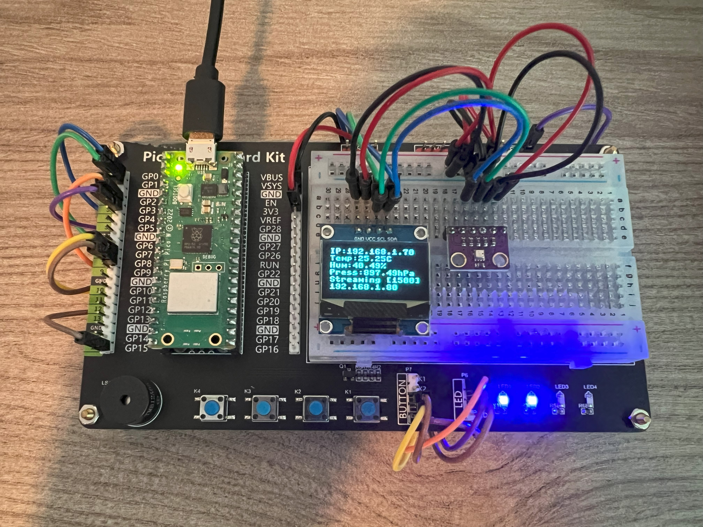
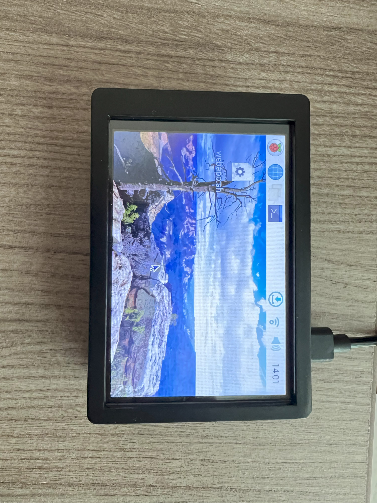

# IOT Project


## Instructions IoT Center
Download docker and docker compose on its latest version.  
Run the following commands:
```
git clone https://github.com/mpavanetti/iot.git
cd iot

# create and add permissions to data folder
sudo mkdir iot_hub/infrastructure/data && sudo chmod -R 777 iot_hub/infrastructure/data

# Create external docker network
sudo docker network create spark-network

# Standard container configuration (No Jupyter Lab)
docker compose up -d 

# Containers plus jupyter Lab (Optional)
docker compose --profile jupyter up -d
or in case you want to start it after just run: docker-compose up -d jupyter-notebook-pyspark


```
  
Access it at http://localhost/  or http://raspberrypi.local/

In this case, I am using a raspberry pi 4 (8GB) as the IoT Center infrastructure host as matter of convinience.  
However you can use and infrastructure (Linux Server) at your choice.  
If you decide to use the raspberry pi 4 as me (optional), here are additional steps that I used to set it up.  
[Notes](iot_hub/infrastructure/README.md)  
  
Obs: jupyerlab initial password = tad
  
  
  
## Instructions IoT Source.
I am using a raspberry pi pico w to interface with the IoT sensors (bme 280) in order to capture the data read by the sensors and send it through tcp/ip to the server.  
1. Go to the oficial micropython download page at https://micropython.org/download/RPI_PICO_W/ 
2. Download the latest .uf2 firmware
3. Plug your raspberry pi pico w into your pc through the usb port.
4. Once it is recognized as an external device, copy the recent .uf2 firmware file to the root of the device. it will reboot.
5. Once it starts up again you won't be able to see it.
6. Download an ide your choice, in my case I am using thonny https://thonny.org/ 
7. If you are using thonny, go to tools manage packages and install the packages **micropython-bme280**, **micropython_ssd1306**, **picozero**.
8. Once you have installed the required library, upload to the raspberry pi pico w the files [data.py](iot_source/picow/data.py) and [main.py](iot_source/picow/main.py).
9. Unplug it from your pc.
10. Plug it into any 5V usb port.


## Images
Webapp home screen.  

  
  
Real time data streaming screen.  
  
  
General Hardware Information screen.
  

### Analytics Dashboard
  
  
  
  

  
### Tools
Interactive Jupyter Lab and spark client.
  

Spark Master with 1 spark worker running.
  
  
## IoT Source

  
## Host Server
In this use case, I am using a raspberry pi 4 (8GB) acting as the docker server. Any linux host could be used in this case


## IoT Components

### Raspberry Pi Pico W
Raspberry Pi Pico Wifi  
Documentation: [raspberrypi oficial documentation](https://www.raspberrypi.com/documentation/microcontrollers/raspberry-pi-pico.html)  
Datasheet:  [raspberry pi oficial datasheet](https://datasheets.raspberrypi.com/picow/pico-w-datasheet.pdf?_gl=1*ciizzx*_ga*MjA3MTMyNTAyOC4xNjkzMTk2Njg0*_ga_22FD70LWDS*MTY5MzE5NjY4NC4xLjAuMTY5MzE5NjY4NC4wLjAuMA..)  
Purchased at Amazon: [Raspberry pi pico w Amazon Canada](https://www.amazon.ca/Freenove-Raspberry-Compatible-Pre-Soldered-Development/dp/B0BJ1PGZCX/ref=sr_1_2_sspa?crid=1A6CTHIL4FI77&keywords=raspberry%2Bpi%2Bpico%2Bw&qid=1693196600&sprefix=raspberry%2Bpi%2Bpico%2Bw%2Caps%2C140&sr=8-2-spons&sp_csd=d2lkZ2V0TmFtZT1zcF9hdGY&th=1).  

  
  

### Pico Breadboard Kit
Purchased at Amazon: [Pico Breadboard Kit Amazon Canada](https://www.amazon.ca/Freenove-Raspberry-Compatible-Pre-Soldered-Development/dp/B0BJ1PGZCX/ref=sr_1_2_sspa?crid=1A6CTHIL4FI77&keywords=raspberry%2Bpi%2Bpico%2Bw&qid=1693196600&sprefix=raspberry%2Bpi%2Bpico%2Bw%2Caps%2C140&sr=8-2-spons&sp_csd=d2lkZ2V0TmFtZT1zcF9hdGY&th=1).  

  

### BME280 Sensor
Combined humidity and pressure sensor BME280  
Datasheet: [Bosh BME280 Datasheet](https://www.bosch-sensortec.com/media/boschsensortec/downloads/datasheets/bst-bme280-ds002.pdf).  
Purchased at amazon: [BME 280 Amazon Canada](https://www.amazon.ca/Pre-Soldered-Atmospheric-Temperature-GY-BME280-3-3-MicroControllers/dp/B0BQFV883T/ref=sr_1_3?crid=1L7XEC6ZMGO0J&keywords=bme+280&qid=1693195924&sprefix=bme+280%2Caps%2C113&sr=8-3). 


  

### LCD Display SSD1306
LCD Display single color, 0.96 inches ssd 1306  
Purchased at amazon: [SSD1306 Display Amazon US](https://www.amazon.com/dp/B06XRBYJR8?ref=ppx_yo2ov_dt_b_product_details&th=1)

